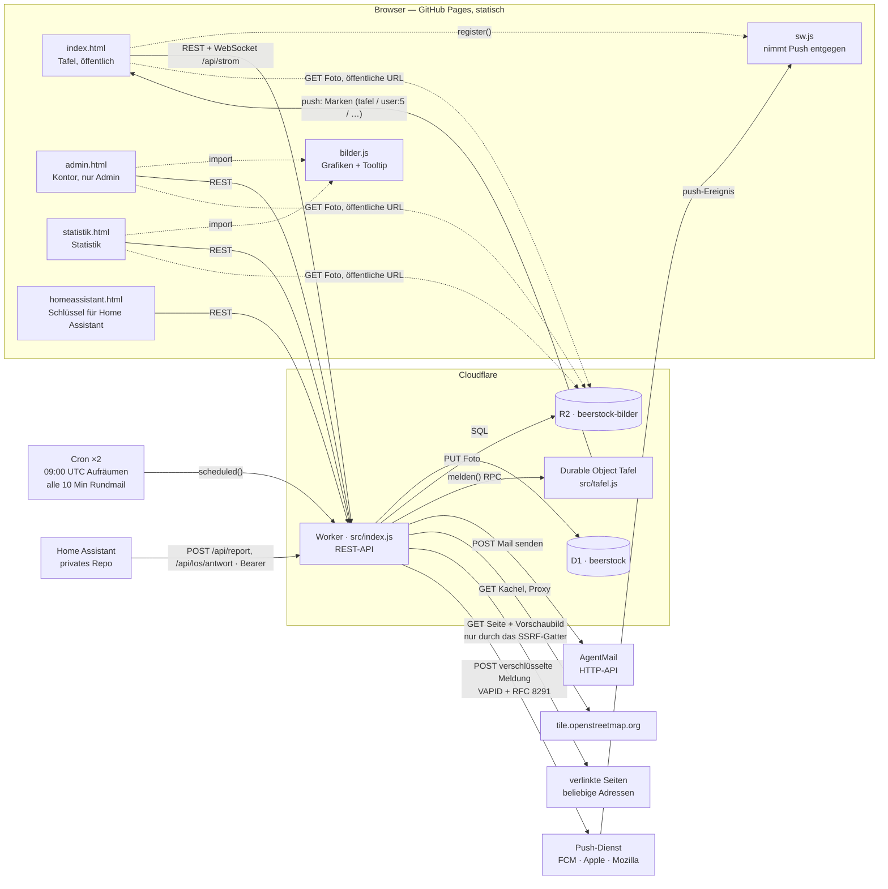

# beerstock

Wer hat gerade am meisten kaltes Bier — live aus dem Kühlschrank.

Die Seite liegt auf <https://schnix84.github.io/beerstock/>.

## Was man sieht

Eine Kneipentafel, alles mit Kreide angeschrieben. Oben steht der **aktuelle
Erste** — nicht ein bestimmter Kühlschrank, sondern der Siegerplatz, und der
wechselt den Besitzer. Darunter das ganze Feld wie eine Speisekarte: Name,
Strichliste, Anzahl, Temperatur und wann zuletzt gemeldet wurde. Die Seite fasst
von selbst nach, solange man sie ansieht.

Der Bestand steht zweimal da, und das mit Absicht. Die Strichliste nennt die
genaue Zahl — Vierergruppe plus Querstrich, wie der Wirt anschreibt. Das Glas
daneben zeigt denselben Bestand als Füllstand und dazu die Temperatur als
Verhalten: kaltes Bier perlt schnell, trägt eine hohe Krone und beschlägt außen,
pisswarmes steht still und flach da. Die Striche zählt man aus der Nähe, das Glas
liest man von weitem.

Ab 24 Flaschen sind beide am Anschlag und sagen nur noch *voll* — die Liste nennt
die Zahl trotzdem. Vierundzwanzig, weil das ein Kasten ist.

Das erste Wort der Fußzeile ist die Ampel: sechs Stufen von *eiskalt* bis
*pisswarm*, und die Farben sind kein Thermometer, sondern ein Urteil. Die
Farbleiste darunter zeigt mit einer Nadel, wo der Kühlschrank gerade steht.

## Wo wird heute getrunken

Einmal am Tag darf die Flasche gedreht werden. Gezogen wird auf dem Worker, nicht
im Browser — sonst dreht jeder sein eigenes Rad und bekommt seine eigene Antwort.
Die Chance sitzt in der Länge des Bogens am Rand: wer mehr kalt hat, wird öfter
gezogen, gedeckelt bei einem Kasten.

Wen es trifft, der **sagt zu oder ab**. Erst die Zusage macht daraus den Abend —
vorher steht nur, worauf die Flasche zeigt. Eine Absage gibt den Tag sofort wieder
frei, und die Flasche darf erneut gedreht werden; wer abgesagt oder drei Stunden
lang nicht geantwortet hat, ist für heute raus und wird nicht noch einmal gezogen.
Der Bierabend-Tag endet dabei nicht um Mitternacht, sondern zwei Stunden später
in UTC — hier also um vier Uhr morgens, im Winter um drei. Wer um halb zwei dreht,
meint den Abend, der gerade läuft; die Stunde Sommerzeit-Drift ist an dieser Grenze
egal, eine ICU-Abhängigkeit wäre es nicht.

## Der Notruf

Wer Bier braucht, jemanden zum Trinken oder beides, drückt **Notruf absetzen**
und wählt zwischen **Bier**, **Trinkkameraden** und **Alles**. Dazu geht der
eigene Standort mit — einmal gefragt, und ohne Freigabe im Browser passiert
schlicht nichts. Auf der Tafel steht der Notruf dann für alle Angemeldeten, mit
einer Karte darunter; ein Druck darauf öffnet die Navigation in Google Maps.
Auch per Mail geht er raus, den Kartenlink gleich darin.

**An alle oder nur an ausgewählte.** Über dem Bier-Knopf steht ein zweiter
Schalter: unter *An alle* geht der Notruf an die ganze Runde, unter *Nur an
ausgewählte* klappen die Namen auf, und es gilt genau, wer angetippt ist. Die
Auswahl gilt für **beides** — die Mail *und* die Karte: wer nicht drinsteht,
bekommt keine Post und sieht die Zeile auf seiner Tafel gar nicht erst. Die
Zeile trägt dann bei allen die Marke *nur an 3*, damit niemand annimmt, es sei
ohnehin schon jemand unterwegs; wer sonst noch gerufen wurde, sagt sie nicht.
Vorausgewählt ist der Kreis vom letzten Mal (im Browser gemerkt), beim ersten
Mal steht dort nichts.

Auch am **laufenden** Notruf lässt sich der Kreis noch ändern, in beide
Richtungen. Dazunehmen schreibt die Neuen sofort an; wegnehmen nimmt dem anderen
die Karte von der Tafel und beendet das Nachwandern des Live-Standorts — die
Mail von vorhin bleibt draußen, die holt niemand zurück. Dass das Wegnehmen
überhaupt geht, ist Absicht: die Fracht ist der eigene Aufenthaltsort, und wer
ihn hergibt, muss ihn auch wieder einsammeln können.

Wer sich bewegt, während der Notruf noch läuft, trägt den neuen Standort über
**Standort aktualisieren** nach — das ändert nur die Koordinaten an derselben
Zeile, ohne die Runde ein zweites Mal anzuschreiben.

**Zurück ins Blatt** kommt man über die eigene Zeile oder die eigene Karte auf
der Tafel: solange ein Notruf läuft, ist *Notruf absetzen* ja weg. Zur eigenen
Karte führt kein „hin" — man steht schon da —, also führt sie ins Blatt.

**Er erlischt von selbst, nach anderthalb Stunden.** Das ist der Kern und nicht
die Kosmetik: ein Notruf, der stehen bleibt, ist keiner mehr, sondern ein
veröffentlichter Aufenthaltsort. Wer früher fertig ist, nimmt ihn zurück; wer
erneut drückt, ersetzt seinen alten, statt einen zweiten daneben zu stellen. Die
Zeile wird danach **gelöscht, nicht archiviert** — es gibt keine Geschichte der
Orte, an denen jemand war, und es soll auch keine geben.

Ohne Token bekommt man davon nichts zu sehen: der Worker schickt die Notrufe nur
im angemeldeten Teil der Antwort mit.

Die Karte zeichnet die Seite selbst — ein Raster aus Kacheln, ein Punkt, ein
Streukreis für die Ungenauigkeit der Ortung. Wandert der Standort, wandert
zuerst nur die Nadel; die Kacheln bleiben stehen. Erst wenn sie dem Rand zu nahe
kommt, wird die Karte neu geholt und neu zentriert — bei einem Live-Notruf, der
alle zwanzig Sekunden nachträgt, spart das den Löwenanteil der Kacheln. Geholt
wird nämlich genau das Sichtfenster und keine Kachel mehr, so verlangen es die
Nutzungsbedingungen; hinter dem Rand ist schlicht nichts.

Keine Kartenbibliothek, und die Kacheln kommen **über den eigenen Worker** statt
direkt von OpenStreetMap. Der
Grund steht ausführlich im Code: eine Kachel-URL *ist* der Standort, und wer sie
ausliefert, wüsste sonst minutengenau, wo jemand steht.

## Termine, Sterne, Gesagtes

Eine Zusage legt den **Termin** gleich mit an — heute 19 Uhr, verschiebbar. Abende,
die aus keiner Ziehung stammen, trägt man von Hand ein: Gastgeber, Tag, Uhrzeit.
Kommende stehen oben, Gewesenes darunter. Abgesagt wird weich: die Zeile bleibt
durchgestrichen stehen, damit die Kommentare darunter ihren Zusammenhang behalten.

Nicht jeder Abend ist bei jemandem. Unter den Namen steht **„Auswärts …"**, und wer
das wählt, schreibt statt eines Gastgebers einen Ort hin — „Schlemmen am Turm", „im
Park". Der Ort ist dann der **Name** des Abends: so heißt die Zeile auf der Tafel,
so heißt der Kalendereintrag in der Mail. Ein „Bierabend" kommt nicht davor — vor
einem Eigennamen stünde sonst ein Wort, das niemand raten kann. Ein Abend auswärts
zählt für niemanden als Gastgeberschaft, dafür darf ihn jeder bewerten, auch der,
der ihn ausgemacht hat — bewertet wird ja der Laden und nicht er.

Die Liste reicht zwei Wochen zurück, sonst wüchse sie mit jedem Abend, den es je
gab. Alles davor steht in der **Chronik** hinter dem Knopf am Kopf der Sektion:
nach Monaten geordnet, seitenweise nachgeladen, und ein Tap öffnet dasselbe Blatt
wie in der Liste — an einem drei Jahre alten Abend sind Sterne, Kommentare,
Reaktionen und Fotos dieselben. Geblättert wird per Zeiger auf den letzten
gezeigten Abend, nicht per Seitenzahl: kommt einer dazu, verschiebt sich sonst die
ganze Liste, und ein Eintrag erschiene doppelt.

Erreichbar ist über die Zeile **jeder** Abend, auch der abgesagte und der, der erst
kommt — geredet wird über beide ("schade" / "bring Chips mit"), nur bewertet nicht.
Warum das Sternfeld gerade stumm ist, sagt das Blatt selbst; die Regel dafür steht
im Worker und nicht zweimal.

**Bewertet** wird mit Sternen in vier Kategorien — einen *Gastgeber* dauerhaft
(Kaltstellen, Auswahl, Gastfreundschaft, Verlässlichkeit), einen *Abend* einmalig
(Versorgung, Location, Stimmung, Ausklang). Keine Kategorie ist Pflicht, ein
einzelner Tap genügt, und die Gesamtnote wird gerechnet statt extra gefragt: zwei
Zahlen, die auseinanderdriften, sind schlechter als eine. Termin-Noten zählen nicht
auf den Gastgeber ein, sonst zählte ein einziger Abend doppelt. Sich selbst bewertet
niemand.

Dazu **Kommentare** mit einer Antwortebene und Reaktionen wie bei Teams: Wer mit der
Maus über eine Karte fährt, bekommt oben rechts eine Leiste — vier Zeichen zum
Sofortdrücken (❤️ 👍 🍺 🍻), daneben der Wähler mit den übrigen fünfzig, und der
Antwortpfeil. Auf dem Handy gibt es kein Überfahren, dort steht die Leiste unter der
Karte. An der Karte selbst steht nur, was wirklich drangeklebt wurde. Ein Tap auf so
eine Reaktion fragt nicht „auch?", sondern „wer?" — darunter klappen die Namen auf,
die sie gesetzt haben. Zurückgenommen wird über denselben Knopf, mit dem sie kam.

**Wem eine Antwort gilt**, steht an ihrem Kopf: „↩ an Basti", anklickbar — die
gemeinte Karte rückt ins Bild und blitzt auf. Die Marke erscheint nur, wo die
Einrückung es nicht schon sagt, also bei einer Antwort auf eine Antwort. Tiefer
eingerückt wird dafür nicht: bei Stufe drei ist die Spalte auf dem Handy vierzig
Pixel breit.
**Ein Link im Text ist ein Link**: er wird angeklickt, nicht abgetippt, und
angeschrieben steht nur Host und Pfad — eine YouTube-Adresse mit Parametern sprengt
sonst auf dem Handy die Karte. Zum ersten Link eines Kommentars klappt kurz darauf
eine **Vorschaukarte** auf: Titel, Anriss, Bild und Herkunft der verlinkten Seite,
so wie Teams und WhatsApp es zeigen. **Sie steht schon beim Schreiben da**, über dem
Feld, sobald ein Link im Satz erkannt wird — mit einem „×", das sie wirklich weglässt
und nicht nur wegräumt. Was dabei geholt wurde, liegt beim Abschicken schon bereit;
der Kommentar bekommt seine Karte dann ohne einen zweiten Griff nach draußen. Wer
einen Link einfügt und sofort abschickt, sieht sie kurz danach nachrücken — über
dieselbe Leitung, über die auch fremde Reaktionen hereinkommen. Zwei Gründe, warum nicht der
Browser das holt: fremdes HTML darf er gar nicht lesen, und er würde jedem *Leser*
eine Verbindung zur verlinkten Seite verschaffen — wer einen Link postet, erführe
damit, wer den Faden gelesen hat. Das Vorschaubild liegt danach im eigenen Bucket,
nicht bei der Gegenseite. Nur der erste Link bekommt eine Karte; drei Karten unter
einem Zweizeiler sind keine Hilfe mehr.
**Steht die Adresse ganz vorn, verschwindet sie aus dem Text** — die Karte zeigt sie
ja schon, und was dahinter noch geschrieben steht, hängt unter der Karte im selben
Rahmen. Mittendrin oder am Ende bleibt sie stehen: dort trägt sie den Satz mit, und
„guck mal auf example.com, da steht es" hätte ohne sie ein Loch. Gibt es keine Karte
— tote Adresse, Seite ohne Kopfdaten —, bleibt der Link ebenfalls im Text; sonst
stünde ausgerechnet der Kommentar leer da, der am meisten erklären müsste.

Wer beim Schreiben schon Sterne vergeben hat, trägt sie über seinem Text —
so liest man, worauf sich das Lob bezieht. Es ist der Stand von damals, nicht der von
heute: hebt jemand später seine Note, bleibt die alte Karte, wie sie war. Gelöscht
wird weich, geantwortet nur eine Ebene tief: bei Stufe drei ist die Spalte auf dem
Handy vierzig Pixel breit.

## Von außen

Wer noch nicht mitschreibt, sieht ein Schaufenster: Siegerplatz, Glas und Ampel
stehen offen da — wer gerade führt, mit wie viel und wie kalt. Die Liste darunter
ist angeschrieben, aber nicht zu lesen. Das Rad und die Abende bleiben zu, das
Blatt mit Sternen und Gesagtem erst recht. Am Fuß steht dafür der ganze Weg
hinein, drei Zeilen lang, und das Adressfeld gleich darunter — ohne Knopf davor,
denn wer erst fragen muss, ob er fragen darf, tippt seine Adresse nicht ein.

**Die Tür ist nicht gemalt.** Ohne `Bearer` gibt `/api/leaderboard` nur den
Siegerplatz heraus — ohne Id, ohne Verlauf, ohne Sternschnitt, dazu `los: null`,
`termine: []`, `chronik: 0` und ein `draussen: true`, an dem die Seite erkennt,
dass die Antwort beschnitten ist. `/api/bewertungen` und `/api/chronik` antworten
dann 401. Verwischt wird deshalb ein *gezeichneter Platzhalter* und keine echte
Zeile: was nicht da ist, kann auch niemand scharfstellen.

Die Seite glaubt dabei dem Worker und nicht ihrem eigenen Speicher. Ein Token,
das der Worker nicht mehr kennt, liegt im Browser noch — ohne `draussen` zeichnete
sie das Bild eines Angemeldeten um eine Antwort herum, die keine ist.

Weil die Bestenliste jetzt je nach `Authorization` anders ausfällt, trägt sie
`Cache-Control: private` und `Vary: Origin, Authorization`. Mit dem alten
`public` hätte ein gemeinsamer Speicher die Antwort eines Angemeldeten an den
nächsten Fremden weiterreichen können.

Drei Nähte bleiben offen, mit Absicht:

- Der **Siegerplatz** nennt Namen, Bestand und Temperatur des Führenden. Das ist
  der Köder, ohne den niemand mitmacht.
- Die **Fotos** liegen weiter unter der öffentlichen R2-Adresse (siehe
  `BILDER_URL` in der `wrangler.jsonc`) — wer eine kennt, sieht sie ohne
  Anmeldung. Die Schlüssel sind zufällige UUIDs, also nicht zu erraten.
- `/api/strom` steht jedem offen. Über die Leitung reisen nur Marken, also
  bestenfalls die Beobachtung, *dass* gerade etwas passiert ist.
- Die **acht Filme** liegen im selben Bucket unter `filme/`, und ihre Namen sind
  anders als die der Fotos zu **erraten** (`filme/3-notruf.mp4`). Sie zeigen eine
  erfundene Runde auf der Testinstanz — wer die Adresse errät, sieht eine
  Vorführung und kein Innenleben.

## Die Tour

Acht kurze Filme zeigen, was die Seite kann — hochkant, gedreht gegen die
Testinstanz mit einer erfundenen Runde, zwischen 33 und 97 Sekunden lang.

Sie stehen an **zwei** Stellen, und keine davon doppelt die andere:

| Wo | Was | Für wen |
|---|---|---|
| Türsteher, unter den drei Schritten: **▶ how to** | **Film 0, „Mitmachen"** — der einzige, der von draußen spielt | wer noch nicht mitschreibt |
| Kleine Zeile unter dem Anschreiben: **Tour** | die anderen **sieben**, als Blatt mit Standbildern | wer angemeldet ist |

Die Null ist bewusst nicht im Blatt: drinnen hat die Frage, wie man hereinkommt,
niemand mehr. Und die sieben sind bewusst nicht draußen: sie zeigen Innenräume —
die Tafel über Wochen, den Notruf, den eigenen Deckel.

Angetippt läuft der Film im Vollbild, eine Ebene über dem Blatt, wie ein Foto in
der Lupe. Geladen wird er **erst dann**: im Blatt stehen nur Standbilder, sonst
wären acht Abrufe fällig, sobald es aufgeht.

Was im Netz liegt, ist eine schmalere Zweitfassung (540 px statt 780, zusammen
16 MB); die 780er bleibt die Fassung zum Verschicken. Gebaut wird sie mit
`./ideas/film/schneiden.sh klein`, hochgeladen von Hand — **mit
`--content-type video/mp4`**, sonst liegt sie als `application/octet-stream` im
Bucket und Safari spielt sie weder ab noch lässt sie sich spulen.

## Wie man mitmacht

Mailadresse eintippen, Link in der Mail klicken, drin. Beim ersten Mal fragt die
Seite noch, wie man in der Liste heißen soll — das war's. Kein Passwort, also
auch keines zu vergessen, und nichts zu speichern, was gestohlen werden könnte.
Wer vorher sehen will, was ihn erwartet: unter den drei Schritten steht **how to**
— das sind 44 Sekunden Film.

Derselbe Weg funktioniert auf jedem weiteren Gerät und beliebig oft. Wer sein
Handy wechselt, den Browserspeicher leert oder von Safari nach sieben Tagen
Untätigkeit ausgeräumt wird, tippt einfach wieder seine Adresse ein. Handy und
Laptop können gleichzeitig angemeldet sein.

**Jedes Einlösen legt dabei ein neues Token an — auch im selben Browser.** Alte
laufen nicht ab und verschwinden nicht von selbst; nach ein paar Wochen stehen
in „mein Deckel" mehr Geräte, als je benutzt wurden, und die überzähligen sind
die Reste geleerter Browserspeicher. Die Zahl dort ist deshalb höher als die
der benutzten Geräte; wer aufräumen will, meldet **alle** ab und kommt einmal
neu. Eine Liste der einzelnen Token stand hier kurzzeitig und ist wieder weg —
sie erklärte die Zahl, machte aber aus der unwichtigsten Auskunft des Blattes
sein größtes Feld.

Wann ein Token zuletzt benutzt wurde, steht in `tokens.zuletzt`. Geschrieben
wird es beim Abruf, aber höchstens einmal je Stunde — die offenen Seiten fragen
im Minutentakt nach, und ein Schreibvorgang je Abruf wären Tausende am Tag für
eine Angabe, die stundengenau genügt. Angezeigt wird sie nirgends; sie ist da,
damit sich per SQL beantworten lässt, welcher Zugang noch lebt.

Gemeldete Werte sind **ungeprüft**. Die einzige Ausnahme trägt die Marke
*gemessen*: dieser Bestand kommt aus einer Kühlschrank-Inventur in Home Assistant
(Kassenbon × Foto × KI), die Temperatur von einem Sensor im Kühlschrank.

### Selbst aus Home Assistant melden

Das kann jeder, ohne dass hier etwas geändert werden muss: `POST /api/report`
nimmt jede Meldung entgegen, egal ob sie aus dem Browser kommt oder von einem
Server. Die Herkunftsprüfung greift nur, wenn ein `Origin`-Kopf mitkommt — ein
Aufruf aus Home Assistant hat keinen, und CORS gilt ohnehin nur im Browser.

**Die Anleitung steht in der App**, unter *Mein Deckel* → *Home Assistant*
(`homeassistant.html`). Dort gibt es den Schlüssel auf Knopfdruck und die drei
YAML-Blöcke mit dem eigenen Schlüssel schon darin, jeder mit einem
Kopierknopf — die Anleitung an dem Ort, an dem man sie braucht, statt einer
Konsolensitzung mit einer Beschreibung daneben. Der Umriss, damit man weiß,
was einen erwartet:

```yaml
# secrets.yaml
beerstock_token: "Bearer 3f9a…"
```

```yaml
# configuration.yaml
rest_command:
  beerstock:
    url: https://beerstock-api.mc-schneider84.workers.dev/api/report
    method: POST
    headers:
      Authorization: !secret beerstock_token
    content_type: application/json
    payload: '{"biere": {{ biere }}, "temperatur": {{ grad }} }'
```

```yaml
action: rest_command.beerstock
data:
  biere: "{{ states('sensor.kuehlschrank_flaschen') | int }}"
  grad: "{{ states('sensor.kuehlschrank_temperatur') | float }}"
```

`biere` ist eine ganze Zahl von 0 bis 999, `temperatur` eine Zahl von −30 bis
30, Komma erlaubt. Das Wort `Bearer` gehört mit in den Wert. Mehr als **eine
Meldung je Minute** und derselbe Nutzer bekommt einen 429er — das ist keine
Abwehr, sondern der Schutz vor dem Freund, der den Knopf zehnmal drückt, weil
er nichts passieren sieht.

**Der Schlüssel gehört zu keinem Gerät.** Bis August 2026 stand hier etwas
anderes: man holte sich das Token des eigenen Browsers per Entwicklerwerkzeug
aus dem `localStorage`. Das ging, war aber an drei Enden falsch — der Weg
führte durch die Konsole, dasselbe Geheimnis lag danach an zwei Orten, und
widerrufen konnte man es nur, indem man sich selbst abmeldete. Seit Schema 27
trägt jedes Token einen `zweck`; der für Home Assistant ist ein eigenes und hat
im Deckel seinen eigenen Weg hinaus.

**Drei Dinge, die man wissen sollte:**

- **Der Schlüssel ist der Zugang, nicht bloß ein Melderecht.** Wer ihn hat, kann
  im eigenen Namen schreiben und alles sehen — er gehört in die `secrets.yaml`
  und nicht in ein Repo, das jemand anders liest.
- **Es gibt genau einen.** Ein neuer widerruft den alten. Zeigen kann die Seite
  ihn kein zweites Mal, gespeichert ist nur seine Prüfsumme.
- **„Alle Geräte abmelden" im Deckel wirft ihn mit weg.** Danach muss ein neuer
  Schlüssel erzeugt und in Home Assistant eingetragen werden.

**Die Marke *gemessen* kommt dabei nicht mit.** Die hängt an
`users.quelle = 'ha'`, einer Spalte in der Datenbank, für die es keinen
Schalter gibt. Und das ist Absicht: die Marke behauptet Bestand aus
Kassenbon × Foto × KI *und* Temperatur aus einem Sensor. Wer nur einen Fühler
hat und die Flaschen von Hand zählt, verspräche damit mehr, als er hält. Wenn
das mehrere so machen wollen, gehört die Marke geteilt, bevor sie vergeben
wird.

## Post vom Wirt, mein Deckel, das Kontor

Wer eine Adresse hinterlegt hat, bekommt Mail — je Anlass abwählbar:

| Art | wann | Vorgabe | auch als Push |
|---|---|---|---|
| `gewonnen` | die Flasche hat einen getroffen | an | ja, dringend |
| `termin_neu` | ein Abend steht fest | an | ja |
| `termin_aendert` | ein Abend verschiebt sich, wird umbenannt oder fällt aus | an | ja |
| `echo` | jemand antwortet auf einen Beitrag oder gibt Sterne | **aus** | ja |
| `notruf` | jemand braucht Bier oder Gesellschaft | an | ja, dringend |
| `rundmail` | gelegentlich, vom Wirt | an | **nein** |

Der Schalter gilt für **beide** Wege: „keine Termin-Post" heißt keine, egal über
welche Leitung. Zwei Schalterreihen für dieselbe Frage wären die sicherste Art,
dass niemand die zweite findet.

Zwei Regeln gelten für alle: Gesperrte und Entfernte bekommen gar keine (der
gemessene Melder hat kein Postfach und fällt damit von selbst heraus), und der
**Ein-Klick-Abmeldelink** in jeder Fußzeile schlägt jede Einzelwahl.

Der **Auslöser** bekommt bei `echo` nichts — wer selbst schreibt, weiß es schon.
Bei den beiden Terminarten bekommt er sehr wohl eine, nur mit anderem Text
(*„Für deinen Kalender"* statt einer Ankündigung): diese Mails tragen einen
Anhang, und ausgerechnet der Gastgeber hätte den Abend sonst in keinem Kalender
stehen. Gegen die doppelte Mail nach einer
abgebrochenen Verbindung steht ein `UNIQUE` auf `mail_ausgang`.

An `termin_neu` und `termin_aendert` hängt ein **Kalendereintrag** (`.ics`). Er
trägt eine feste `UID` (`termin-<id>@beerstock`) und eine steigende `SEQUENCE`
(Spalte `termine.fassung`) — damit *ersetzt* eine Verschiebung den vorhandenen
Eintrag, statt einen zweiten daneben zu legen, und eine Absage räumt ihn per
`METHOD:CANCEL` weg. Bewusst `METHOD:PUBLISH` und nicht `REQUEST`: `REQUEST` ist
eine Einladung und zeigt im Postfach Zusagen-/Absagen-Knöpfe, deren Antwort an
ein Postfach ginge, das niemand liest. Zugesagt wird auf der Tafel.

**Kein Link aus einer Mail tut etwas von selbst.** Alle drei — Anmelden,
Abmelden, die Antwort des Gewinners — führen auf die Seite und schlagen dort ein
Blatt mit einem Knopf auf. Erst der Fingertipp handelt. *Ein Aufbau der Seite
ist kein Mensch, der etwas will:* Mailscanner und Sicherheitssoftware laden
Links vor, und iOS Mail rendert für die Vorschau beim langen Druck die ganze
Seite samt JavaScript.

Beim Gewinner-Link galt das von Anfang an; die beiden anderen haben es am
7. August 2026 nachgereicht. Der **Anmeldelink**, weil er auf dem iPhone
nachweislich unbrauchbar geworden war: die Vorschau verbrannte das Token, bevor
der Empfänger die Finger bewegt hatte, und wer die Tafel auf dem Homescreen
liegen hat, kam damit gar nicht mehr herein. Der **Abmeldelink** aus der
Fußzeile aus derselben Überlegung, bevor es jemandem passiert — und er ist der
unangenehmere Fall: wer sich nicht anmelden konnte, merkt es sofort; wer still
stumm gestellt wurde, merkt es erst, wenn wochenlang keine Post kommt. Ein
Abmeldelink soll mit einem Klick wirken, und das tut er weiterhin — der Klick
ist nur nicht mehr der auf den Link in der Mail, sondern der auf den Knopf, der
daraufhin dasteht.

Zwei Links kommen ohne Anmeldung aus: das Abmelden und die Antwort des
Gewinners. Beide tragen eine **HMAC-Signatur statt einer Zeile in der Datenbank**
— sie steht nirgends, sie wird gerechnet, und ein Rundumschlag ist ein neues
`MAIL_GEHEIM`.

### Push aufs Gerät

Die Mail ist zu langsam für das, was eine Frist hat: der Gezogene hat drei
Stunden zum Antworten, ein Notruf gilt neunzig Minuten, und eine Mail liegt so
lange im Postfach, wie es dem Postfach gefällt. Deshalb geht dasselbe
**zusätzlich** als Push aufs Gerät — nie statt der Mail, und nur, wenn man den
siebten Schalter im Deckel umlegt. Wer nichts einschaltet, merkt davon nichts.

Dafür ist die Tafel **installierbar**: `manifest.webmanifest`, `sw.js` und
`icon.png` liegen als Geschwisterdateien neben `index.html`. Das ist die eine
bewusste Ausnahme vom Grundsatz *eine geschlossene Datei* — ein Service Worker
muss eine eigene Datei gleicher Herkunft sein, und iOS nimmt für das App-Symbol
keine `data:`-Adresse an. **`sw.js` fasst die Auslieferung der Seite nicht an:
kein `fetch`-Zuhörer, kein Cache.** Sonst klebte eine alte Tafel im Browser, und
„der Deploy wirkt nicht" bekäme eine zweite Ursache neben der Edge-Karenz.

Verschlüsselt wird nach **RFC 8291** (`aes128gcm`), ausgewiesen nach **RFC 8292**
(VAPID) — beides in `worker/src/webpush.js`, purem WebCrypto, ohne
Abhängigkeiten. Der Push-Dienst reicht die Meldung nur weiter; lesen kann er sie
nicht. Ein totes Gerät antwortet mit 404 oder 410 und wird beim Senden aus
`push_abos` gelöscht — die Tabelle räumt sich beim Benutzen auf, es gibt keinen
Cron dafür. Der Endpoint eines Abos ist praktisch ein Geheimnis (wer ihn hat,
kann diesem Gerät zustellen) und geht in **keiner** API-Antwort heraus.

Was in der Nutzlast steht, ist absichtlich mager: Titel, ein Satz, eine
Sprungmarke (`#los=<id>`, `#termin=<id>`, `#notruf`) und eine Marke zum
Ersetzen liegender Meldungen. **Nie ein Token** — wer den Push bekommt, ist auf
dem Gerät schon angemeldet.

**Auf dem iPhone** gibt Safari Push nur an eine Seite heraus, die auf dem
Home-Bildschirm liegt (ab iOS 16.4). Das hat eine Folge, die man erst merkt,
wenn man davorsteht: eine solche App hat ihren **eigenen Speicher**, und der
Anmeldelink aus der Mail öffnet beim Antippen immer Safari, nie die App. Darum
gibt es in der installierten App ein Feld **„Link aus der Mail"** — Link
gedrückt halten, kopieren, dort einsetzen. Antippen verbraucht ihn in Safari; er
gilt einmal und fünfzehn Minuten. Die Anmelde-Mail sagt das auch.

**Mein Deckel** (Flyout auf der Tafel) ist die Selbstverwaltung: Name ändern,
Adresse wechseln, die sechs Mail-Schalter, der Push-Schalter, alle Geräte abmelden. Der Adresswechsel ist
zweistufig — der Link geht an die neue Adresse, die alte bekommt eine Warnung und
gilt weiter, bis dort geklickt wurde. Wer die Rolle `admin` hat, findet ganz
unten den Knopf **Mitgliederverwaltung** — der einzige Wegweiser ins Kontor.

**Das Kontor** (`admin.html`) gehört der Rolle `admin`: sperren, entsperren,
Rolle tauschen, entfernen, acht Grafiken, Rundmail, Protokoll. Gleiche Herkunft
wie die Tafel, also dasselbe Token — kein zweiter Login und damit auch kein
zweiter Angriffsweg. Wer der erste Admin ist, sagt das Secret `ADMIN_MAIL`: wer
sich mit dieser Adresse anmeldet, wird beim Einlösen des Links zum Admin. Das ist
selbstheilend, sonst wäre ein Kontor ohne Admin nur noch per SQL zu öffnen.

Die **Rundmail** kann ein Bild und einen Knopf tragen — dasselbe `mailKnopf`-Muster
wie bei Termin- und Gewinner-Mails, kein freier HTML-Editor. Sie geht entweder
sofort raus oder wird für einen Zeitpunkt vorgemerkt (Tabelle `rundmail_geplant`);
vorgemerkt bleibt sie editierbar und verwerfbar, bis sie fällig wird. Ein zweiter
Cron (alle zehn Minuten, siehe `wrangler.jsonc`) verschickt, was ansteht — jede
fällige Zeile bekommt genau einen Versuch, eine an der Stundensperre gescheiterte
bleibt `fehlgeschlagen` liegen statt es beim nächsten Lauf mit demselben Ergebnis
erneut zu versuchen. Die Vorschau im Kontor sieht aus wie die echte Mail
(serifenlos auf Weiß), nicht wie das Kontorbuch drumherum.

Entfernt wird **weich**: Adresse, Name und Token verschwinden, die Beiträge
bleiben als *Ehemaliger* stehen. Hart geht nicht — `kommentare.autor_id` hat
`ON DELETE CASCADE` und risse ganze Threads mit, `termine.gastgeber_id` und
`los.user_id` haben keine und hinterließen Waisen. Gesperrte bleiben in der Liste
stehen (mit der stillen Marke *ruht*) und fallen aus dem Rad; sie dürfen weiter
lesen, aber nichts mehr schreiben, und bekommen auch keinen frischen Magic Link
mehr. Der gemessene Melder ist sperrbar, aber nicht entfernbar: das risse die
Anbindung der Wohnung ab.

## Aufbau

```
index.html           eine einzelne, in sich geschlossene Seite ohne externe Ressourcen
statistik.html       die Statistiken: die Bilder zur Runde — für jeden Angemeldeten
homeassistant.html   Schlüssel und Anleitung für den, der aus seiner Wohnung melden will
admin.html           das Kontor: Nutzerverwaltung, Statistik, Rundmail — nur fuer Admins
bilder.js            die Grafiken samt Tooltip; statistik.html und admin.html teilen sie
sw.js                nimmt Push-Meldungen entgegen — sonst nichts, kein Cache
manifest.webmanifest macht die Tafel installierbar (Name, Symbol, Vollbild)
icon.png             das App-Symbol, 512×512 — und das Bild in der Push-Meldung
og.png               das Schild für WhatsApp & Co. (1200×630, siehe Kopf von index.html)
worker/              Cloudflare Worker + D1 + R2: Registrierung, Meldungen, Bestenliste
worker/src/tafel.js  Durable Object: verteilt an alle offenen Seiten, was sich geändert hat
worker/src/webpush.js  VAPID + RFC-8291-Verschlüsselung, purer WebCrypto
worker/migrations/   das Schema, eine Datei je Schritt — die Reihenfolge ist die Geschichte
```

Die vier Geschwisterdateien im Wurzelverzeichnis holt der Browser **nicht** beim
Aufbau der Seite: `og.png` sehen nur Vorschau-Sammler, `manifest`/`sw.js`/`icon.png`
nur, wer die Tafel installiert. „Eine geschlossene Datei" bleibt damit heil.

Dasselbe gilt für die Fotos an den Kommentaren und für die acht Filme der
Tour: sie liegen in R2 und werden geholt, wenn jemand sie ansieht — nie beim
Aufbau. Die Filme liegen dort unter `filme/`; im Repo liegt keiner von ihnen.

`bilder.js` ist die einzige geteilte Datei, und sie ist es aus einem Grund: an
einem Tooltip, der zweimal dasteht, ändert man beim zweiten Mal nichts mehr. Sie
bekommt beim Start eine Palette und zeichnet damit dieselben Formen einmal in
Kreide (Verlauf) und einmal in Tinte (Kontor). **Die Tafel lädt sie nicht** — für
`index.html` gilt weiter: eine Datei, keine externen Ressourcen. Sie zeigt nur
einen Knopf, der hinüberführt.

**Jeder Melder hat eine Farbe, und zwar überall dieselbe.** Neun Kreiden, und
welche jemand trägt, sagt der Worker als *Platz* (`users.farbe`, Schema 28) —
entweder der im Kontor gewählte oder der aus der Anmeldereihenfolge. Damit ist
derselbe Mensch am Rad-Bogen, an seiner Bestands- und Temperaturkurve, an den
liegenden Balken, im Jahresrückblick und am Monogramm im Kontor gleich gefärbt.
Vorher hing die Farbe an der *Stellung* im jeweiligen Bild, und wer heute vorn
lag, war grün.

Die neun Töne stehen an vier Stellen: als Vorgabe in `bilder.js`, als
`menschen`-Reihe in `statistik.html` und `admin.html` und als `MENSCHEN` in
`index.html` (die Tafel lädt `bilder.js` ja nicht). Wer die Reihe ändert, ändert
alle vier — und die Zahl neun kennt zusätzlich der Worker als `FARBEN`, er
prüft damit die Wahl im Kontor.

Sie sind gezogen, nicht gewählt (`ideas/pruefungen/kreide-suche.mjs`): engster
Abstand zweier Töne 15,6 gegen eine Schwelle von 15, bei Rot-/Grünblindheit 6,4
— beides auf Schiefer **und** Kartengrund. **Sieben war einmal die Grenze, und
im Kreidebereich ist sie es weiter:** acht Töne kommen dort über 13,5 nicht
hinaus und fallen durch. Die achte und neunte gibt es trotzdem, weil nicht der
Farbraum der Riegel war, sondern das selbstgesetzte Helligkeitsband — `#adc83e`
und `#61ccdb` liegen darüber und lesen sich merklich heller als der Rest. Die
beiden harten Abstandsböden bleiben dabei auf dem Wert der alten sieben; der
Validator des dataviz-Skills sagt zu der Reihe nur deshalb *durchgefallen*, weil
er das Band prüft. Das ist eine **benannte Abweichung, keine bestandene
Prüfung** — und der Preis dafür, dass neun Melder neun Kreiden haben. Der zehnte
teilt sich Magenta mit dem ersten; der Wirt kann das im Kontor auflösen.

Angehängt und nicht nach Farbton einsortiert: der Index **ist** die Identität,
und ein Einsortieren zöge jedem ab Platz 2 die Kreide unter den Füßen weg.

Getrennt davon bleibt die `reihe`: die färbt *Rollen* — den Ausgang einer
Ziehung, die Anteile einer Säule, zugesagt gegen abgesagt. Zwei Reihen, zwei
Aufgaben; wer sie zusammenlegt, färbt irgendwann einen Menschen wie einen
Zustand.

**Und einer trägt den Regenbogen** (Schema 29). Er ist eine **zehnte Farbwahl**
neben den neun Kreiden: im Kontor unter *Mitglieder* öffnet „Farbe" die
Punktreihe, und der letzte Punkt darin ist der Regenbogen. Getragen wird er
aber **immer nur von einem zugleich** — aus allen, die ihn gewählt haben, lost
der Biertag einen aus. Alle anderen schreiben so lange in ihrer Kreide, und wer
ihn heute trägt, fällt morgen auf sie zurück; dasselbe passiert, sobald sich der
Kreis ändert. Darum bleibt neben dem Regenbogen auch immer ein Kreidepunkt
gedrückt: das ist die Farbe darunter.

Wer ihn trägt, trägt ihn **überall** — Bogen, Name und Bestand am Rad, seine
Zeile auf der Tafel und der große Name darüber, der Kopf seines Blattes, jeder
seiner Beiträge im Faden (und jedes „an ihn" darüber), sein Name über einem
Bierabend und unter „von", seine Notrufzeile, sein Name und seine
Balkenbeschriftung im Jahresrückblick, seine Kurve und seine Balken in den
Statistiken der Runde **und** in denen des Wirts, sein Monogramm im Kontor. Wer ihn gewählt hat, ihn heute aber nicht trägt, ist dort am Ring um
sein Monogramm zu erkennen: außen die sechs Töne, innen die Kreide, in der er
heute schreibt.

**Und hinter seinem Namen steht ein „:in".** Überall dort, wo der Regenbogen den
Namen färbt, hängt der Zusatz mit dran — „Basti:in" auf der Tafel, am Rad, im
Faden, in den Statistiken und auf seiner Karte im Kontor. Er entsteht beim
Zeichnen und wird nirgends gespeichert: im Worker heißt jeder weiter, wie er
heißt, und morgen steht er wieder ohne da. Zwei Stellen bekommen ihn bewusst
nicht: die Auswahlliste im Formular und die Sätze des Rades („… hat abgesagt"),
denn dort ist der Name ohnehin nicht bunt.

Zweimal ist er kein Name. Das **Bier im Glas** oben auf der Tafel gehört dem,
der das Feld anführt — steht dort ein Träger, ist auch sein Bier bunt. Und der
**Holzrahmen** um das Brett gehört dem Leser: wer heute den Regenbogen trägt,
sieht ihn um seine Tafel, seine Statistiken, sein Kontor und seinen
Wohnungsschlüssel. Alle anderen sehen Holz. Der Rahmen ist dabei weiter Holz —
Maserung, Gehrung, Fase und Falz bleiben, die sechs Töne liegen nur als Anstrich
darüber.

Der Regenbogen gilt sonst immer dem **Namen** und nie dem Satz um ihn herum:
„Bierabend bei Jonas" bleibt Kreide bis auf das eine Wort. Einmal ist er
statt eines Namens ein **Umriss** — der Namensknopf im Empfängerkreis des
Notrufs steht für einen Menschen, nicht neben ihm. Er trägt ihn deshalb als
Kante, solange er nur wählbar ist, und als Füllung, sobald er gewählt ist:
dieselbe Aussage wie bei allen anderen Knöpfen dort, umrandet heißt „gibt es",
gefüllt heißt „gilt jetzt".

Ein Schalter über den Karten sagt zusätzlich, **ob** überhaupt gelost wird
(„aus" behält die Auswahl), und daneben steht **weiterdrehen**: ein Schritt
weiter durch den Kreis, ohne auf die Tagesgrenze zu warten. Ein Schritt und
kein neuer Wurf — bei zweien im Kreis fiele ein echter Wurf in der Hälfte der
Fälle wieder auf denselben, und ein Knopf, der sichtbar nichts tut, sieht kaputt
aus.

Technisch ist der Regenbogen der **Platz 99** — eine Marke, die die Kreidereihe
nie erreicht: alles, was `farbe` schon liest, trägt ihn ohne eine zweite Zutat
im Datenweg —
auch das eingefrorene Feld einer Ziehung, ein Rad von vorgestern zeichnet sich
also mit den Farben von vorgestern. Nur die Mitgliederliste im Kontor bekommt
ihn getrennt (`stolz_heute`): dort muss unter dem Regenbogen die gewählte Kreide
sichtbar bleiben, sonst zeigte die Farbreihe nicht mehr, worauf er zurückfällt.

Wer es heute ist, wird nirgends gespeichert — es wird aus dem Biertag gerechnet
(`bierTag()`, Tagesgrenze um 2 Uhr statt um Mitternacht) und fällt darum überall
gleich aus, ohne dass eine Leseroute dafür schreiben müsste. Die sechs Töne sind
die Hue-Winkel der Flagge, gehoben in dasselbe Helligkeits- und Buntheitsband
wie die sieben Kreiden (`ideas/pruefungen/stolz-reihe.mjs`): die Flagge selbst
geht auf Schiefer nicht — ihr Grün hat dort einen Kontrast von 1,6 und wird zu
einem Loch, ihr Gelb sticht so heraus, dass vom Verlauf nur Gelb bleibt. Es ist
ein Regenbogen **aus Kreide**, kein Neonschild.

### Wer heute Geburtstag hat

Der zweite Tageszustand, der an einem Menschen hängt — und mit Absicht nicht
derselbe wie der Regenbogen. **Jeder trägt seinen eigenen unter *mein Deckel*
ein**, gleich unter dem Namen; der Wirt kann es zusätzlich im Kontor an jeder
Karte. Beide Stellen haben dieselben **drei Wählräder** — Tag, Monat, Jahr. Ein
Kalenderfeld wäre hier das falsche Werkzeug: ein Geburtstag liegt Jahrzehnte
zurück, und der native Kalender öffnet im laufenden Monat und blättert
monatsweise. In einer Liste springt man mit der Tastatur direkt auf die
Jahreszahl.

Im Deckel stehen die drei zusammen genau so breit wie das Namensfeld darüber —
gleiche linke Kante, gleiche rechte, derselbe Haken dahinter. Sie schreiben dort
eine Spur kleiner als das Namensfeld: auf einem 360 px breiten Telefon ist das
der Unterschied zwischen „September" und „Septemb".

**Das Jahr darf wegbleiben** — der Strich im dritten Rad ist eine gültige Wahl.
Gespeichert wird dann `MM-TT`, sonst `JJJJ-MM-TT` (`users.geburtstag`,
Schema 31). Tag oder Monat auf dem Strich löscht den Eintrag. Ob ein Jahr
dabeisteht, ändert an der Anzeige nichts: **das Alter erscheint nirgends.**
**Das Jahr wird nirgends angezeigt** — auf der Tafel steht „Geburtstag" und
keine Zahl. Ein Alter neben dem Namen wäre eine Auskunft
über einen Menschen, die die Tafel für ihn herausgibt und nicht er. Diese Angabe
darf man auch im Kontor bei sich selbst setzen, und zwar als einzige mit einem
echten Grund: der Betreffende ist der Einzige, der sie sicher weiß — und genau
deshalb steht sie überhaupt am Deckel.

Auf der Tafel feiert die **ganze Zeile** mit. Sie bekommt einen goldenen Rahmen,
um den ein helles **Lauflicht** wandert, und an der Oberkante hängt eine
**Girlande** — eine Wimpelkette in Gold und Champagner, deren Schnur die Kante
des Rahmens selbst ist. Dazu der **wandernde Goldschimmer** im Namen und eine
Marke mit Krone.

Bei **jedem Öffnen** der Seite fällt zusätzlich einmal Konfetti über die ganze
Tafel, mit einem Gruß darüber — „brunx hat heute Geburtstag / Und gewinnt heute —
immer!", und wer selbst gemeint ist, liest „Alles Gute, brunx! / Du gewinnst
heute — immer!". Einmal je Aufbau, nicht bei jedem Nachladen: die Tafel frischt
sich im Minutentakt auf, und was beim ersten Mal überrascht, wäre beim dritten
eine Belästigung. Wer `prefers-reduced-motion` gesetzt hat, bekommt diesen Regen
nicht; Rahmen, Girlande, Schimmer, Krone und Gruß bleiben stehen — ein
Geburtstag ist dann ruhig und nicht abwesend.

Anders als der Regenbogen reitet er **nicht** auf `farbe` mit, sondern kommt als
eigenes `geburtstag` an der Zeile (und als `geburtstag_heute` in `/api/me`). Der
Grund steht in `worker/migrations/0031`: Platz 99 ersetzt die Kreide eines
Menschen, und ein zweiter Platz für den Geburtstag hieße, dass sich an einem
Tag entscheiden müsste, welche der beiden Auszeichnungen verschwindet. So trägt
wer beides hat auch beides. Innerhalb des Namens gilt dabei weiter der Vorrang
des Regenbogens — zwei Verläufe auf denselben Buchstaben gibt es nicht —, und
**seit die Zeile selbst feiert, kostet dieser Vorrang nichts mehr**: Rahmen,
Lauflicht und Girlande hängen an der Zeile und nicht an der Schrift, der
Regenbogenträger bekommt sie also genauso wie jeder andere.

„Heute" ist auch hier der **Biertag** und nicht der Kalendertag: wer um drei
Uhr nachts noch am Tisch sitzt, hat weiter Geburtstag. Der 29. Februar bekommt
keine Ausweichregel — wer ihn einträgt, wird in drei von vier Jahren nicht
gefeiert; jede Ersatzregel wäre eine Entscheidung über den Geburtstag eines
anderen Menschen.

#### Das Rad am Geburtstag

Die Flasche gehört an diesem Tag dem Geburtstagskind, und zwar in zwei Stufen:

1. **Die erste Drehung ist echt und es gewinnt** — mit Termin, Mail und allem.
   Es richtet aus, das ist das Geschenk der Runde. Gezogen wird trotzdem und
   nicht gesetzt: haben zwei am selben Tag Geburtstag, entscheidet zwischen
   ihnen weiter der Bestand.
2. **Danach sind alle weiteren Drehungen Ehrenrunden.** Der Knopf bleibt stehen
   und heißt „Nochmal für …"; die Flasche landet immer auf dem Geburtstagskind,
   es regnet Konfetti — und es passiert **sonst nichts**: kein Los, kein Termin,
   keine Mail, kein Anstoß an die anderen Tafeln. Die Ehrenrunde läuft
   vollständig auf der Seite und ruft den Worker gar nicht erst.

Steht der Abend des Geburtstagskindes an diesem Tag schon (es hat ihn selbst
eingetragen oder er findet bei ihm statt), **entfällt Stufe 1**: dann gibt es
den ganzen Tag nur Ehrenrunden. Wo getrunken wird, ist ja bereits entschieden,
und eine Auslosung daneben könnte es nur noch falsch beantworten. `POST
/api/drehen` antwortet an so einem Tag mit 409 — für den Tab, der seit dem
Morgen offensteht.

Wer heute geehrt werden kann, sagt der Worker im `los`-Objekt als
`ehre: {fuer:[Namen], nur:bool}`; fehlt der Schlüssel, hat niemand Geburtstag.
Ein Geburtstagskind **ohne kaltes Bier** hat kein Feld im Rad und steht deshalb
nicht darin — die Flasche könnte gar nicht auf es zeigen. Es wird an der Tafel
trotzdem gefeiert, nur eben ohne Rad. Für die Ehrenrunde gilt die Mindestgröße
des Topfes **nicht**: sie ist keine Auslosung.

### Architektur

Nur der Worker schreibt; alles andere ist statisch oder ruft bei ihm an. Die
Tafel (`index.html`) ist die einzige Seite mit offener Leitung — Kontor und
Statistik holen sich alles über REST nach.



Drei Dinge, die die Zeichnung festhält und die Prosa sonst verstreut sagt: die
Tafel lädt `bilder.js` **nicht** — nur Kontor und Statistik teilen sich die
Grafiken. Fotos aus R2 liest der Browser **direkt** über die öffentliche
`r2.dev`-Adresse, am Worker vorbei — nur das Hochladen läuft über ihn. Und die
Wohnung ruft **an**, statt erreichbar zu sein: Home Assistant meldet sich beim
Worker wie jeder andere Melder, nicht umgekehrt.

Der Pfeil nach *verlinkte Seiten* ist der einzige, an dessen Ende keine feste
Adresse steht. Giphy, Imgflip und OpenStreetMap baut der Worker sich selbst
zusammen; für die Link-Vorschau ruft er eine Adresse ab, die ein Angemeldeter
getippt hat — seit sie schon beim Schreiben erscheint, sogar eine, aus der nie ein
Kommentar werden muss. Deshalb steht davor ein Gatter: nur `http`/`https`, keine
Zugangsdaten in der Adresse, keine Namen aus dem lokalen Netz, keine privaten
IP-Bereiche, und **jede** Weiterleitung wird einzeln neu geprüft, statt sie dem
`fetch` zu überlassen — sonst wäre eine harmlose Adresse, die auf `10.0.0.1`
umleitet, der Weg daran vorbei.

In „Bestand je Melder" und „Temperatur je Melder" laufen **stumme Tage
fortgeschrieben** weiter: wer nichts meldet, hat deshalb nicht weniger im
Kühlschrank — er hat nichts gesagt. Der letzte bekannte Stand bleibt waagerecht
stehen, bis eine neue Zahl kommt. Das ist reine Zeichnung: fortgeschriebene Tage
zählen **nicht** als Meldung (das Bild „Meldungen je Tag" bleibt unberührt), und
im Tooltip stehen sie blass, mit dem Datum ihrer Meldung dahinter. Vor der ersten
Meldung wird nichts fortgeschrieben — die Linie beginnt, wo der Mensch beginnt.

„Vorrat der Runde" macht dasselbe für alle zusammen, aber **im Worker** statt in der
Zeichnung: eine Zahl je Tag, die Summe der zuletzt gemeldeten Stände. Fortgetragen
wird als Treppe — wer Montag zwölf meldet und Freitag vier, hatte Mittwoch zwölf und
nicht acht. Ein Stand, der älter als sieben Tage ist, fällt heraus (dieselbe Grenze
wie im Rückblick); sinkt die Kurve dadurch auf null, heißt das nicht „nichts mehr da",
sondern „seit einer Woche sagt es keiner". Vor der ersten Meldung überhaupt fängt sie
gar nicht erst an.

Die Seite ist statisch und fragt nur. Geschrieben wird ausschließlich über den
Worker; die Wohnung selbst ist von außen nicht erreichbar und ruft dort an, statt
angerufen zu werden.

Die Wohnung meldet ihren Bestand über dieselbe Route wie jeder andere
(`POST /api/report`) und steht in derselben Liste. Es gibt keinen zweiten Weg
mehr: bis August 2026 schrieb Home Assistant zusätzlich ein `status.json` über
die GitHub-Contents-API in dieses Repo, als Rückfallebene für den Fall, dass der
Worker nicht antwortet. Das ist abgeschafft. Jede Meldung war ein Commit, und
dessen Zeitstempel ist öffentlich und minutengenau — die Datei rundete den
Zeitpunkt des letzten Kühlschrankfotos absichtlich auf die volle Stunde, die
git-History daneben gab ihn dann doch preis, dazu den Verlauf des Bestands.
Antwortet der Worker nicht, zeigt der Deckel jetzt nichts.

### Die Seite bleibt von selbst aktuell

Wer die Seite offen hat, sieht neue Meldungen, Ziehungen, Kommentare, Sterne und
Reaktionen **ohne Reload** — auch bei geöffnetem Kommentarblatt und offener
Chronik. Dahinter steht
eine WebSocket (`GET /api/strom`) zu einem einzigen Durable Object, an das jede
Schreibroute meldet, was sie geändert hat.

Über die Leitung reisen dabei **nur Marken, keine Daten**: `tafel` (Liste, Rad,
Termine) oder ein Ziel wie `user:5`. Was dahintersteckt, holt die Seite über
dieselben GET-Routen wie beim ersten Aufbau. Damit gibt es keine zweite Fassung
der Antwortlogik, die auseinanderlaufen könnte, und niemand kann über die Leitung
etwas mitlesen, was er nicht ohnehin abrufen dürfte — geprüft wird beim Abruf.

Drei Dinge, die dazugehören:

- **Die Leitung ersetzt das Nachfragen, nicht das Laden.** Ein Zeitgeber fasst
  weiter nach, solange jemand hinsieht: alle drei Minuten mit stehender Leitung,
  jede Minute ohne sie (dann pollt auch das offene Blatt mit). Eine WebSocket geht
  verloren, ohne dass es jemand merkt — eine Seite, die dann nichts mehr täte, sähe
  aus wie eingefroren.
- **Der Absender lädt nicht doppelt.** Jeder Schreibvorgang trägt eine zufällige
  Tab-Kennung als `X-Tab` mit, die an der verteilten Meldung hängt; der eigene
  Tab überspringt sie, seine Antwort war früher da.
- **Nichts wird unter den Fingern weggezogen.** Gezeichnet wird nur, wenn die
  Antwort sich wirklich geändert hat; während einer Radanimation oder eines
  eigenen Schreibvorgangs wird der Anstoß gemerkt und danach nachgeholt. Beim
  Neuzeichnen des Blattes bleiben Scrollstand und getippter Text stehen.
- **Auch die Uhr läuft mit.** Ein Abend fängt an und hört auf, ohne dass jemand
  etwas schreibt — davon käme also nie eine Marke. Statt eines Tickers je
  Sekunde stellt sich ein einziger Wecker auf den nächsten Zeitpunkt, an dem
  sich überhaupt etwas ändern kann: Anfang und Ende jedes Abends, dazu die Frist
  der offenen Ziehung. Dort zeichnet die Seite die Terminliste neu und fragt
  einmal nach — an der Frist ist das mehr als Kosmetik, das Los ist dann
  verfallen und das Rad wieder frei. Dazwischen schläft sie, der Wechsel sitzt
  trotzdem auf der Sekunde. Was im Schlaf des Geräts liegen bleibt, holen der
  Blick auf die Uhr beim Aufwachen und das 20-Sekunden-Netz nach.

### API

| Route | Was |
|---|---|
| `POST /api/anmelden` | `{email}` → schickt einen Magic Link |
| `POST /api/magic` | `{token}` aus dem Link → Geräte-Token |
| `POST /api/name` | Name für die Liste setzen |
| `POST /api/geburtstag` | `{geburtstag}` — den **eigenen** Geburtstag setzen oder löschen (`JJJJ-MM-TT`, `MM-TT` oder `null`), aus *mein Deckel*. Kennt kein Ziel, schreibt immer auf den Aufrufer; dieselbe Prüfung wie im Kontor. Kein Anstoß an die anderen Tafeln und kein Protokolleintrag |
| `GET /api/me` 🔒 | wem das Token gehört: Name, Adresse, Rolle, Sperre, Mailschalter, Gerätezahl, dazu `vapid` — der öffentliche Push-Schlüssel oder `null`, wenn der Worker kein Push kann. `ha_zugang` ist `{seit, zuletzt}`, wenn ein Schlüssel für Home Assistant eingerichtet ist, sonst `null`; die Gerätezahl zählt ihn **nicht** mit. `stolz_heute` sagt, ob der eigene Holzrahmen heute bemalt ist, `geburtstag_heute`, ob man heute selbst gefeiert wird. Ein **Alter gibt diese API nirgends heraus** — gefeiert wird, *dass* jemand Geburtstag hat, nicht *wie oft* |
| `POST /api/report` | `{biere, temperatur}` mit `Bearer`-Token |
| `POST /api/abmelden` | wirft nur dieses eine Gerät raus |
| `POST /api/geraete/alle-abmelden` 🔒 | wirft **alle** raus, auch dieses **und den für Home Assistant** — das verlorene Handy |
| `POST /api/ha/zugang` 🔒 | legt den Schlüssel für Home Assistant an → `{token, ersetzt}`. Es gibt genau einen: ein vorhandener wird dabei widerrufen (`ersetzt: true`). Das Klartext-Token steht **nur in dieser einen Antwort**, gespeichert ist der Hash |
| `POST /api/ha/zugang/weg` 🔒 | widerruft nur den Schlüssel für Home Assistant, kein Gerät → `{weg}`; zweimal gerufen ist kein Fehler |
| `POST /api/einstellungen` 🔒 | `{mail:{art:bool}}` und/oder `{stumm:bool}`; unbekannte Arten → 400. Gilt für Mail **und** Push |
| `POST /api/push/abo` 🔒 | `{endpoint, schluessel:{p256dh, auth}}` — dieses Gerät zum Klopfen anmelden. UPSERT auf `endpoint`: die Seite ruft bei jedem Start, denn Push-Dienste tauschen Adressen im Stillen aus, und ein Gerät, an dem sich jemand anderes anmeldet, wandert mit |
| `POST /api/push/weg` 🔒 | `{endpoint}` — nur die eigene Zeile; zweimal gerufen ist kein Fehler |
| `POST /api/mail/aendern` 🔒 | neue Adresse; Link an die **neue**, Warnung an die **alte**, bis dahin gilt die alte |
| `POST /api/mail/stumm` | `{id, sig}` aus dem Ein-Klick-Abmeldelink — ohne Anmeldung, per HMAC |
| `POST /api/drehen` | die Flasche drehen; ein zweiter Ruf liefert dasselbe Los. Hat heute jemand Geburtstag und noch keinen Abend, **gewinnt er** (siehe *Das Rad am Geburtstag*); steht sein Abend schon, antwortet die Route mit 409 und es gibt nur Ehrenrunden. Die laufen auf der Seite und rufen hier gar nicht an |
| `POST /api/los/antwort` | `{antwort:'ja'\|'nein', grund?, beginnt_am?, endet_am?}` — nur der Gezogene, per Token **oder** mit `{los, t}` aus der Gewinner-Mail |
| `POST /api/termin` | `{gastgeber, beginnt_am, endet_am?, titel?}` → ein Abend von Hand; mit `{ort}` statt `gastgeber` einer auswärts |
| `POST /api/termin/aendern` | verschieben, umbenennen, absagen; ohne `endet_am` wandert das Ende beim Verschieben mit |
| `POST /api/bewerten` | `{ziel_art, ziel_id, sterne{}, text?, bild?, ohne_vorschau?}` — überschreibt |
| `GET /api/bewertungen` 🔒 | `?ziel=user:5` — Schnitte, eigene Abgabe, Kommentarbaum |
| `POST /api/bild` | rohe Bytes im Rumpf, kein JSON → `{key, bild}`; der `key` gehört an den nächsten Kommentar |
| `GET /api/gif` 🔒 | `?q=…&weiter=…` — GIF-Suche über Giphy, ohne `q` das Angesagte; `[{id, vorschau, breite, hoehe, titel}]` |
| `POST /api/gif/holen` 🔒 | `{id}` holt das gewählte GIF nach R2 → `{key, bild}`, dieselbe Form wie `/api/bild` |
| `GET /api/meme/vorlagen` 🔒 | die Imgflip-Vorlagen, abgespeckt: `[{id, name, breite, hoehe}]`, 24 Stunden im Cache |
| `GET /api/meme/vorlage` | `?id=…` — ein Vorlagenbild durch den Worker (Grund wie bei `/api/kachel`: kein `Authorization`-Kopf im ``), `id` muss in der gerade gecachten Vorlagenliste stehen, sonst 404 |
| `POST /api/vorschau` 🔒 | `{url}` — die Vorschaukarte schon beim Tippen → `{fuer, vorschau}`; `vorschau` ist `null`, wenn es (noch) nichts zu zeigen gibt, nie ein Fehler. Dasselbe SSRF-Gatter und dieselbe Tabelle wie der Weg nach dem Abschicken, und damit auch dessen Cache |
| `POST /api/kommentar` | `{ziel_art, ziel_id, text?, bild?, antwort_auf?, ohne_vorschau?}` — Text oder Bild muss da sein; `antwort_auf` darf auf eine Antwort zeigen, sie hängt dann an deren Wurzel, und der Adressat bleibt als `an_id` stehen; `ohne_vorschau` ist das „×" an der Karte über dem Schreibfeld |
| `POST /api/kommentar/aendern` | `{id, text, ohne_vorschau?}` oder `{id, loeschen:true}` |
| `POST /api/reaktion` | `{kommentar_id, art}` — `art` ist das Emoji selbst und muss in `REAKTIONEN` stehen (die Liste im Worker, nicht im Schema); Schalter, derselbe Druck nimmt zurück; zurück kommen `anzahl` und die `namen` |
| `POST /api/notruf` 🔒 | `{art:'bier'\|'kamerad', lat, lon, genau?, live?, kreis?}` — gilt 90 Minuten, ein erneuter Ruf ersetzt den eigenen. `kreis` fehlend oder `null` heißt an alle, eine Liste von Nutzer-Ids heißt nur an diese; `[]` ist ein Fehler und kein „an niemanden". Genau die **eigene** Id allein ist die *Probe*: der Notruf steht vollständig auf der eigenen Tafel, schreibt aber niemanden an und zählt in keiner Statistik mit — erlaubt nur für den Wirt |
| `POST /api/notruf/standort` 🔒 | `{lat, lon, genau?}` — trägt nur den Standort am laufenden Notruf nach, ohne neue Mail |
| `POST /api/notruf/live` 🔒 | `{live}` — legt den Schieberegler am laufenden Notruf um, ohne Koordinaten und ohne Mail |
| `POST /api/notruf/kreis` 🔒 | `{kreis}` — ersetzt den Empfängerkreis am laufenden Notruf, in beide Richtungen. Dazugekommene werden angeschrieben (Doppelmails bremst `mail_einmal`), Weggenommenen verschwindet die Karte |
| `GET /api/kreis` 🔒 | `{leute:[{id, name, farbe}], probe}` — wer sich anwählen lässt: alle Angemeldeten mit Namen außer einem selbst, ohne Gesperrte und Entfernte. `probe` ist die eigene Id für den Wirt und sonst `null` — daraus baut die Seite den Knopf „Ich selbst (Probe)". Nicht aus `feld`, das kennt nur, wer schon einmal gemeldet hat |
| `POST /api/notruf/weg` 🔒 | nimmt den eigenen zurück; zweimal gerufen ist kein Fehler |
| `GET /api/kachel` | `?z=&x=&y=` — Kartenkachel über den Worker statt direkt von OSM; sieben Tage im Cache, fremder Referer → 403 |
| `GET /api/chronik` 🔒 | `?vor=…&vor_id=…&anzahl=…` — gewesene Abende, seitenweise |
| `GET /api/leaderboard` | Rangliste, Bestmarke, 30 Tage Verlauf, Ziehung des Tages, laufende Notrufe — ohne Token nur der Siegerplatz |
| `GET /api/statistik` 🔒 | die Zahlenreihen der Runde für die Statistikseite; `?tage=30\|60\|90` fasst die Zeitreihen, die Ranglisten bleiben insgesamt. Bestand und Temperatur stehen je Tag und Melder mit der **letzten** Meldung des Tages drin, nicht mit dem Schnitt; bei der Temperatur fahren `tief`, `hoch` und die Zahl der Meldungen mit. Stumme Tage stehen dort **nicht** in der Antwort — die schreibt erst die Zeichnung fort (siehe unten). Zwei Reihen folgen dem Fenster bewusst nicht: `wachstum` und `abende` sind Fragen an die ganze Geschichte der Runde. `vorrat` dagegen ist die einzige Reihe, die der Worker selbst über stumme Tage fortschreibt, weil eine Summe über alle Melder sich nachträglich nicht zeichnen lässt |
| `GET /api/strom` | WebSocket; verteilt Marken wie `{"marken":["tafel","user:5"]}` |
| `GET /api/admin/nutzer` 🔒 | die ganze Runde mit Adressen und Zahlen — nur Admin, sonst 403 |
| `POST /api/admin/nutzer` 🔒 | `{id, aktion:'sperren'\|'entsperren'\|'rolle'\|'entfernen'\|'farbe'\|'stolz'\|'geburtstag', grund?, farbe?, geburtstag?}` — nur Admin. `farbe` ist der Platz in der Kreidereihe (0–6) oder `null` für „wieder nach Anmeldereihenfolge"; `stolz` ist ein Umschalter ohne Wert und wählt den Regenbogen als achte Farbe dazu oder ab — die Kreide daneben bleibt dabei stehen, sie ist die Farbe darunter. `geburtstag` nimmt `JJJJ-MM-TT`, `MM-TT` (Jahr freiwillig) oder `null` zum Löschen und prüft den Tag auch auf seine Gültigkeit im Monat. Diese drei sind auch mit sich selbst erlaubt |
| `POST /api/admin/stolz` 🔒 | `{aktiv: bool}` — der Schalter über der Regenbogenvergabe. Gilt keinem Mitglied, deshalb eine eigene Route; „aus" behält den Kreis. `{weiter: true}` dreht den Kreis stattdessen um **einen Schritt** weiter (Schema 30), ohne auf die Tagesgrenze zu warten — gespeichert wird dabei kein Träger, nur eine Verschiebung auf den Wurf |
| `GET /api/admin/statistik` 🔒 | dasselbe **plus Betrieb**: Mails je Art und je Tag, Anmeldungen, wer noch Post will, Seitenaufrufe insgesamt/je Tag/je Nutzer — nur Admin |
| `POST /api/admin/rundmail` 🔒 | `{betreff, text, bild_url?, knopf_text?, knopf_link?}` sofort an alle, die sie wollen — nur Admin |
| `POST /api/admin/rundmail/planen` 🔒 | dieselben Felder plus `{versand_am}` — vorgemerkt statt sofort verschickt, nur Admin |
| `POST /api/admin/rundmail/test` 🔒 | dieselben Felder ohne `versand_am`, geht nur an die eigene Adresse — ohne Stundensperre, ohne Protokoll- oder Statistikeintrag |
| `GET /api/admin/rundmail/geplant` 🔒 | die noch anstehenden und die fehlgeschlagenen geplanten Rundmails — nur Admin |
| `POST /api/admin/rundmail/geplant/aendern` 🔒 | `{id, ...Felder}` ändert eine geplante Rundmail, `{id, verwerfen:true}` löscht sie — geht nur, solange sie noch `geplant` ist |
| `GET /api/admin/protokoll` 🔒 | was passiert ist, aus drei Quellen zusammen (Verwaltung, Mail, Push). Blättert: `?limit=` (Vorgabe 20, höchstens 50) und `?vor=` mit der Marke `weiter` der vorigen Seite. `?quelle=admin\|mail\|push` siebt nach Weg, `?q=` nach Wort — gesucht wird in Name, Betroffenem, Art, Detail, Auslöser und Empfängern. Die mitgelieferten `zaehler` zählen über die **ganze** Geschichte und lassen `q` bewusst außen vor. Nur Admin |
| `GET /api/health` | Bereitschaft: Datenbank, Mailversand, Bilderablage, Neu-Meldung, Verteiler, `ADMIN_MAIL`, `MAIL_GEHEIM`, `GIPHY_KEY`, `push` (beide VAPID-Hälften); dazu **zwei Stände**, die das Kontor unter der Ampel nebeneinanderstellt: `version`/`deployed_at` vom letzten Worker-Deploy und `seite_version`/`seite_deployed_at`/`seite_stand` vom letzten Commit auf `main` (bei GitHub erfragt, eine Viertelstunde gecacht) |

🔒 heißt: braucht den `Bearer`-Token, sonst 401. Für die `POST`-Routen gilt das
ohnehin — sie schreiben; die beiden Ausnahmen sind `/api/anmelden` und
`/api/magic`, denn das ist ja der Weg zum Token. `GET /api/leaderboard` antwortet
auch ohne, dann aber nur mit dem Siegerplatz (siehe *Von außen*).

Grenzen: 0–999 Biere, −30…+30 °C, eine Meldung pro Minute und Nutzer, ein
Absagegrund von höchstens 120 Zeichen. Ausgelost wird ab zwei Meldern mit etwas
Kaltem; nach einer Absage genügt einer, sonst sperrte ein einziges Nein den Abend.
Termine: höchstens 3 je Nutzer und Tag, 90 Tage im Voraus. Kommentare: 400 Zeichen,
30 am Tag, 200 je Ziel, 10 Sekunden Abstand — dieselbe Bremse wie bei den Meldungen,
gegen den Freund, der zehnmal drückt. Sie gelten auch für den Text neben den Sternen,
der ja derselbe Kommentar wird. Fotos: 2 MB, JPEG/PNG/WebP, ebenfalls 30 am Tag und
10 Sekunden Abstand — eine eigene Bremse, weil das Hochladen *vor* dem Abschicken
läuft und die Kommentarsperre hier noch nichts aufhält. Verkleinert wird schon im
Browser (lange Kante 1600 px, JPEG 0.8), aus 4 MB Handyfoto werden ~250 kB; der
Deckel steht trotzdem, denn der Worker redet nicht nur mit unserem Browser.
Weil das Hochladen vor dem Abschicken läuft, bleibt liegen, wer es sich anders
überlegt: solche Bilder ohne Kommentar räumt der tägliche Cron weg, aber erst
nach einem Tag — solange darf das Formular offen stehen bleiben.
GIFs und Memes hängen sich an denselben Weg: ein GIF wird beim Holen ein
`bild_key` wie ein Foto und zählt gegen dasselbe Tagesbudget und dieselbe
Bremse, ein Meme ist ohnehin ein JPEG wie jedes andere. Die GIF-Suche selbst
ist zusätzlich eine Stunde im Cache, damit Giphys Deckel von 100 Abrufen die
Stunde für eine Runde wie diese nie in Sicht kommt.
Zeiten reisen als ISO-8601 mit Zone, und der Worker rechnet in den ANTWORTEN nie
um — die Seite kennt die Ortszeit ihres Betrachters, er nur die der Wohnung. In
den **Mails** tut er es doch, denn dort steht kein Browser dazwischen: die
Laufzeit hat volles ICU einschließlich Zeitzonen (gemessen 2026-08-03, Sommer-
und Winterzeit stimmen). Eine ältere Anmerkung im Quelltext behauptet das
Gegenteil; sie stammt aus einer Zeit, in der es so war.

Nutzerverwaltung: 3 Adresswechsel je Nutzer und Tag (dazu dieselben Bremsen wie
beim Magic Link, es ist dieselbe Tabelle), Sperrgrund 120 Zeichen, Rundmail 4000
Zeichen bei 120 im Betreff und höchstens eine je Stunde — die Stunde gilt für den
tatsächlichen Versand, nicht fürs Planen, und trifft eine geplante Rundmail sie
beim Fälligwerden, bleibt sie `fehlgeschlagen` liegen statt es beim nächsten
Cron-Lauf erneut zu versuchen. Bild- und Knopf-Adresse: `https://`, höchstens 500
Zeichen, der Knopftext höchstens 40. Eine geplante Rundmail darf höchstens 90 Tage
im Voraus liegen; der Cron dafür prüft alle zehn Minuten, keine Uhrzeit auf die
Minute. Die Testmail (`.../rundmail/test`) geht ausschließlich an den anfragenden
Admin selbst, läuft an der Stundensperre vorbei und trägt sich weder ins Protokoll
noch in die Mail-Statistik ein.

Notruf: 90 Minuten Geltung, 20 Sekunden zwischen zweien desselben Nutzers, einer
je Nutzer gleichzeitig. Kartenkacheln nur zwischen Zoom 12 und 18 und nur mit
eigenem Referer; geholt wird ausschließlich, was gerade jemand ansieht — kein
Vorabladen, das verlangen die Nutzungsbedingungen der Kacheln ausdrücklich.

Magic Links gelten 15 Minuten und genau einmal, höchstens 3 pro Adresse und Stunde und 30
insgesamt — sonst wäre der Posteingang ein Versandknopf im Netz. CORS
ausschließlich für diese Seite. Geräte-Token und Magic Links liegen in der
Datenbank nur als SHA-256 — ein Abzug verrät, wer wie viel Bier hat, macht aber
niemanden handlungsfähig.

Der Link reist im Adressfragment (`#anmelden=…`), nicht als Suchparameter: ein
Fragment wird nie an einen Server geschickt und steht damit in keinem
Zugriffsprotokoll. Die Seite räumt es sofort nach dem Einlösen aus der Adresszeile.

Mails gehen über [AgentMail](https://agentmail.to) raus — reine HTTP-API, kein
SMTP. Der Schlüssel liegt als Worker-Secret `AGENTMAIL_KEY`.

Über dieselbe Leitung erfährt der Gastgeber von jedem Neuen: eine Mail an
`MELDE_AN`, sobald sich einer zum ersten Mal einen Namen gibt — mit Name,
Adresse und dem wievielten Melder. Genau einmal je Nutzer; wer sich später
umbenennt, löst nichts aus. Auch `MELDE_AN` ist ein Secret, hier aber nur, damit
die Adresse nicht im offenen Repo steht; fehlt sie, bleibt die Meldung aus. Sie
geht nach der Antwort raus (`waitUntil`) und ist in jedem Fehlerfall stumm — an
einer Meldung, die nicht ankommt, soll keine Anmeldung scheitern.

Meldungen werden nie überschrieben: der aktuelle Stand ist die jüngste Zeile je
Nutzer, der Verlauf fällt dabei von selbst an.

### Deployen

**Erst das Schema, dann der Worker** — die Reihenfolge ist zwingend. Ein Worker,
der eine Spalte abfragt, die es noch nicht gibt, macht jeden Aufruf der Bestenliste
zum 500er.

```bash
cd worker
npx wrangler d1 migrations apply beerstock --remote  # Schema
npx wrangler deploy --var GIT_SHA:$(git rev-parse --short HEAD)$([ -n "$(git status --porcelain -- src)" ] && echo '+') --var DEPLOYED_AT:$(date -u +%Y-%m-%dT%H:%M:%SZ)  # Worker
```

Einmalig dazu die Secrets, sonst geht keine Mail raus und keine Meldung ein:

```bash
npx wrangler secret put AGENTMAIL_KEY   # der Schluessel fuer den Versand
npx wrangler secret put MELDE_AN        # wer von jedem Neuen erfaehrt
npx wrangler secret put ADMIN_MAIL      # wer sich damit anmeldet, wird Admin
npx wrangler secret put MAIL_GEHEIM     # zufaellig, 32+ Zeichen, fuer die HMAC-Links
npx wrangler secret put GIPHY_KEY       # fuer GET /api/gif, gratis-Beta-Schluessel reicht
```

`GET /api/health` sagt zu jedem, ob er anliegt — nie seinen Wert. Ohne
`ADMIN_MAIL` kommt niemand ins Kontor, ohne `MAIL_GEHEIM` trägt keine Mail einen
Abmeldelink; beides sähe von außen wie ein Fehler im Browser aus.

Zum Prüfen ohne echten Versand: eine `.dev.vars` mit `MAIL_ATTRAPPE=1` neben die
`wrangler.jsonc` legen (gitignored). `schickeMail()` schreibt dann in die Konsole,
statt AgentMail anzurufen — sonst ist jeder Testlauf eine echte Mail an eine echte
Adresse, und beim Durchspielen des Verteilers sind das schnell sechs auf einen
Schlag.

Ebenfalls einmalig der Eimer für die Fotos — und der ist zweiteilig:

```bash
npx wrangler r2 bucket create beerstock-bilder --location weur
```

Dazu im Dashboard unter *R2 > beerstock-bilder > Settings* die **Public
Development URL** einschalten und die entstandene `r2.dev`-Adresse als
`BILDER_URL` in die `wrangler.jsonc` eintragen, ohne Schrägstrich am Ende. Ohne
den Eimer antwortet `POST /api/bild` mit 503; steht er, fehlt aber die Adresse,
kommt jedes hochgeladene Bild als `bild: null` heraus und sieht von außen wie ein
Fehler im Browser aus. `GET /api/health` sagt unter `bilder`, an welchem von
beidem es liegt. Warum die öffentliche Adresse und keine geschützte Worker-Route:
`` schickt keinen `Authorization`-Kopf (siehe *Von außen*).

Der Verteiler braucht kein eigenes Kommando: `Tafel` steht als Durable Object in
`wrangler.jsonc` und entsteht beim ersten Deploy mit. Er speichert nichts —
`new_sqlite_classes` steht dort trotzdem, weil nur SQLite-gestützte Klassen im
kostenlosen Tarif laufen.

Die Seite selbst liegt auf GitHub Pages — ein Push auf `main` genügt. Sie darf
hinterherkommen: die alten Felder bleiben in den Antworten erhalten. Umgekehrt
auch — eine Seite, die `/api/strom` noch nicht findet, fällt auf ihren
Zeitgeber zurück und arbeitet weiter wie vorher.

Direkt nach `wrangler deploy` antwortet die Edge kurz noch mit der alten Fassung.
Vor der Fehlersuche also schlicht eine halbe Minute später noch einmal abfragen.
